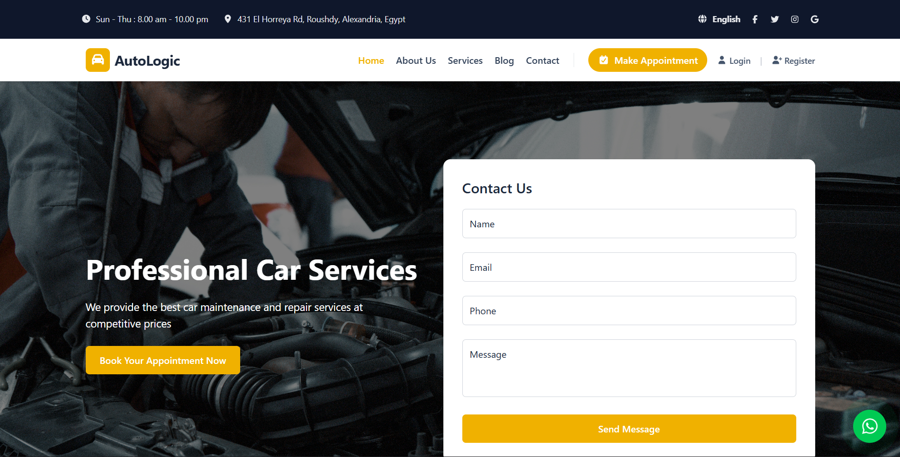
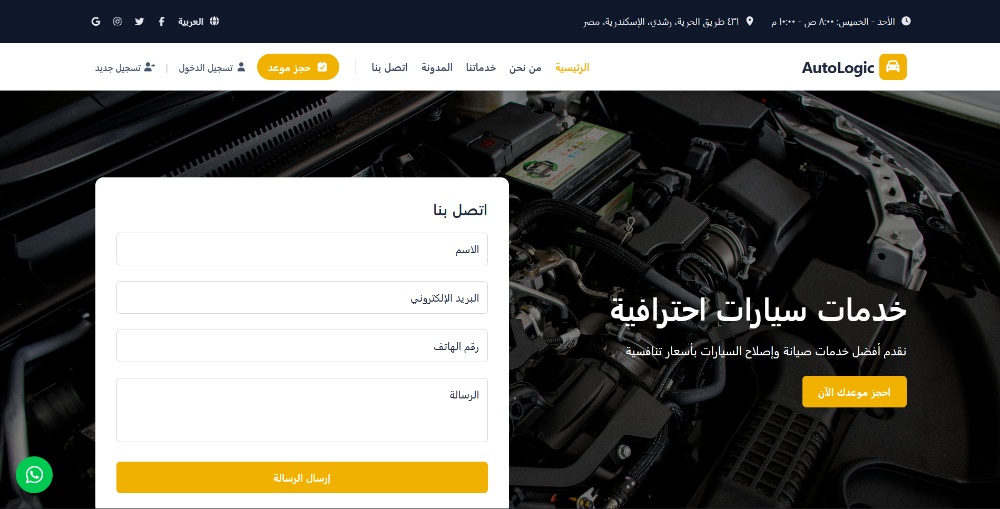
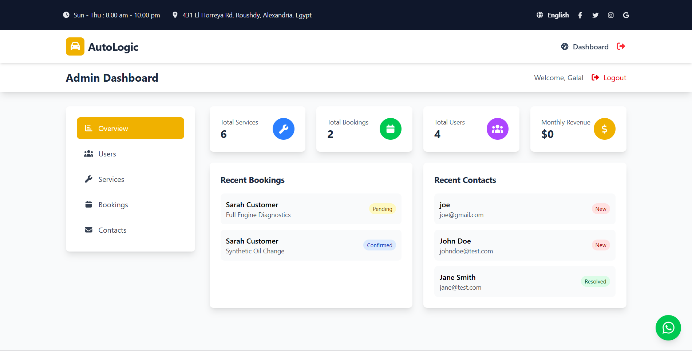
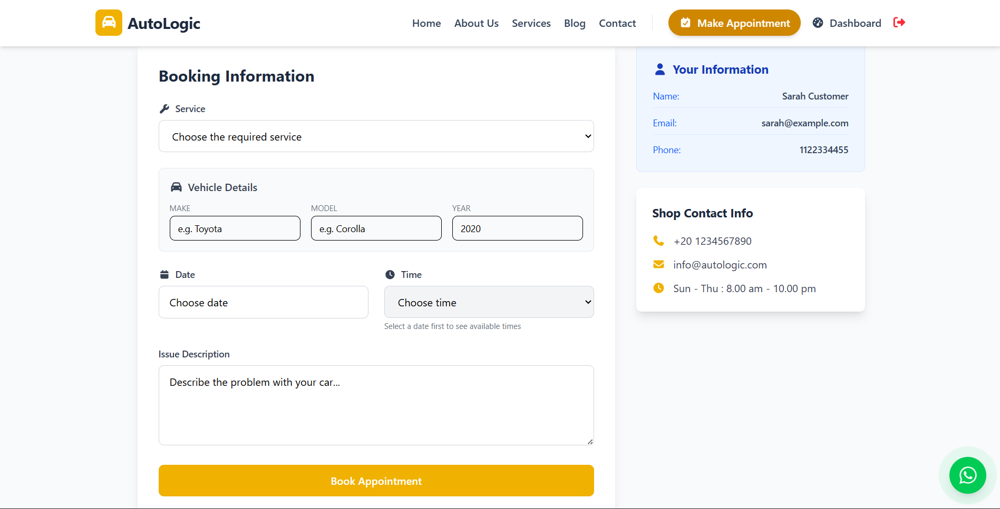

# 🚗 AutoLogic - Car Services & Roadside Assistance

**AutoLogic** is a full-stack web application designed to streamline car maintenance booking and roadside assistance. It features a bilingual interface (English/Arabic), a robust booking system, and comprehensive dashboards for both Customers and Administrators.

Built as a final project for the **DEPI React Web Development Course**.

---

## ✨ Key Features

### 🌍 General & UI

- **Fully Bilingual:** Complete support for **English (LTR)** and **Arabic (RTL)** with automatic layout switching.
- **Responsive Design:** Optimized for Desktop, Tablet, and Mobile devices.
- **Real-time Notifications:** Toast notifications for user actions (Booking, Login, Updates).
- **Direct Support:** Floating WhatsApp button and integrated Google Maps for location.

### 👤 Customer Experience

- **Service Browsing:** View detailed service catalogs with pricing, duration, and images.
- **Smart Booking:** Select services, choose available time slots dynamically, and provide vehicle details.
- **User Dashboard:** Track booking status (Pending, Confirmed, Completed) and view booking history.
- **Profile Management:** Update personal details and secure password management.

### 🛡️ Admin Dashboard (CMS)

- **Analytics:** Real-time overview of bookings, revenue, and user statistics.
- **Service Management:** Create, Edit, Delete services with **Image Uploads** via Cloudinary.
- **Booking Management:** Assign technicians, update booking statuses, and view customer info.
- **User Management:** Manage users, technicians, and admins.
- **Inbox:** Receive and manage contact form messages with status tracking (New/Read/Resolved).

---

## 🛠️ Tech Stack

### Frontend

- **React.js (Vite):** Fast and modern UI library.
- **TypeScript:** For type safety and robust code.
- **Tailwind CSS:** For responsive and custom styling.
- **i18next:** For translation and full RTL support.
- **Axios:** For API communication.
- **React Hook Form:** For efficient form handling and validation.
- **React Hot Toast:** For beautiful notifications.

### Backend

- **Node.js & Express:** Robust RESTful API architecture.
- **MongoDB & Mongoose:** NoSQL database for flexible data modeling.
- **JWT (JSON Web Tokens):** Secure authentication and authorization.
- **Cloudinary:** Cloud storage for handling image uploads.
- **Multer:** Middleware for handling file data.

---

## 🚀 Getting Started

Follow these steps to run the project locally.

### 1. Prerequisites

- Node.js (v16 or higher)
- MongoDB (Local or Atlas Connection String)
- Cloudinary Account (for image uploads)

### 2. Installation

**Clone the repository:**

```bash
git clone https://github.com/Galal012/AutoLogic.git
cd autologic
```

### 3. Backend Setup

Navigate to the backend folder and install dependencies:

```bash
cd backend
npm install
```

Create a **`.env`** file in the `backend` folder with the following variables:

```env
PORT=5000
MONGODB_URI=your_mongodb_connection_string
JWT_SECRET=your_super_secret_jwt_key
CLOUDINARY_CLOUD_NAME=your_cloud_name
CLOUDINARY_API_KEY=your_api_key
CLOUDINARY_API_SECRET=your_api_secret
```

**Run the Seeder (Optional):**
To populate the database with sample users, services, and blogs:

```bash
npm run scripts/seedDatabase
```

**Start the Server:**

```bash
npm run dev
```

### 4. Frontend Setup

Open a new terminal, navigate to the frontend folder, and install dependencies:

```bash
cd frontend
npm install
```

Create a **`.env`** file in the `frontend` folder:

```env
VITE_API_URL=http://localhost:5000/api
```

**Start the Frontend:**

```bash
npm run dev
```

Visit `http://localhost:5173` in your browser.

---

## 🔐 User Roles & Credentials (Seeder Data)

If you ran the seeder script, use these credentials to test:

| Role           | Email                 | Password      | Access                |
| :------------- | :-------------------- | :------------ | :-------------------- |
| **Admin**      | `admin@autologic.com` | `admin123456` | Full Dashboard Access |
| **Technician** | `tech@autologic.com`  | `user123456`  | Technician View       |
| **User**       | `sarah@example.com`   | `user123456`  | Booking & Profile     |

---

## 📸 Screenshots

### 🏠 Home Page (English & Arabic)

<div style="display: flex; gap: 10px;">
  
  
</div>

### 📊 Admin Dashboard



### 📅 Booking Flow



---

## 📂 Project Structure

```text
/backend
  /middleware    # Auth, Error Handling, Validation
  /models        # Mongoose Schemas (User, Booking, Service, etc.)
  /routes        # API Endpoints
  /scripts       # Database Seeder
  /utils         # Helpers (JWT, Cloudinary, AppError)
  server.js      # Entry point

/frontend
  /src
    /Components  # Reusable UI (Navbar, Footer, WhatsAppButton)
      /AdminDashboard  # Admin specific components (Modals, Tables)
      /UserDashboard   # User specific components
    /i18n        # Translation Config & Locales (ar.json, en.json)
    /Pages       # Main Views (Home, Login, Services, Booking)
    /services    # Centralized API Bridge (api.ts)
    App.tsx      # Main Router & Layout
    main.tsx     # Entry point
```

---

## 🤝 Contributing

1.  Fork the repository.
2.  Create a new branch (`git checkout -b feature/AmazingFeature`).
3.  Commit your changes (`git commit -m 'Add some AmazingFeature'`).
4.  Push to the branch (`git push origin feature/AmazingFeature`).
5.  Open a Pull Request.

## 📄 License

Distributed under the MIT License. See `LICENSE` for more information.
